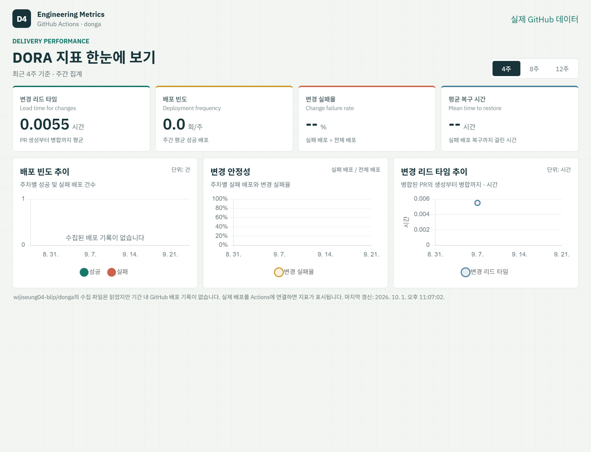

# StudyMate — 스터디 모집 및 관리 웹 서비스

## 1. 프로젝트 소개

StudyMate는 스터디를 효율적으로 모집하고 관리할 수 있도록 지원하는 웹 서비스

스터디 모집, 일정 관리, 학습 기록 등을 하나의 서비스에서 관리하여 스터디 활동을 보다 편리하게 진행할 수 있도록 하는 것을 목표로 한다.

---

## 2. 문제 정의

온라인이나 오프라인으로 스터디를 진행할 때 스터디원 모집, 일정 관리, 학습 기록 등을 여러 플랫폼에서 따로 관리해야 하는 불편함이 있다.

StudyMate는 이러한 문제를 해결하기 위해 스터디 모집부터 일정 관리, 학습 기록까지 하나의 웹 서비스에서 관리할 수 있도록 한다.

---

## 3. 핵심 기능

### 1) 스터디 생성 및 모집

- 스터디 생성
- 스터디 제목 및 내용 등록
- 모집 인원 설정
- 스터디 참여 신청
- 스터디 참여자 관리

### 2) 스터디 일정 관리

- 스터디 일정 등록
- 일정 조회
- 일정 수정 및 삭제
- 스터디 참여 일정 확인

### 3) 학습 기록 관리

- 학습 내용 기록
- 학습 시간 기록
- 스터디별 학습 기록 조회
- 누적 학습 기록 확인

---

## 4. 기술 스택

### Backend

- Java
- Spring Boot

### Database

- MySQL

### Frontend

- HTML
- CSS
- JavaScript

### Development & Collaboration

- Git
- GitHub

---

## 5. 16주 마일스톤 계획

| 주차 | 마일스톤 |
|---|---|
| **1주차** | 프로젝트 주제 선정 및 문제 정의 |
| **2주차** | 요구사항 분석 및 핵심 기능 선정 |
| **3주차** | 서비스 구조 및 화면 설계 |
| **4주차** | 데이터베이스 구조 설계 |
| **5주차** | Spring Boot 개발 환경 구축 |
| **6주차** | 회원가입 및 로그인 기능 구현 |
| **7주차** | 스터디 생성 및 조회 기능 구현 |
| **8주차** | 스터디 수정 및 삭제 기능 구현 |
| **9주차** | 스터디 모집 및 참여 신청 기능 구현 |
| **10주차** | 스터디 일정 관리 기능 구현 |
| **11주차** | 학습 기록 등록 기능 구현 |
| **12주차** | 학습 기록 조회 및 통계 기능 구현 |
| **13주차** | 검색 및 필터 기능 구현 |
| **14주차** | 예외 처리 및 테스트 |
| **15주차** | UI 개선 및 기능 보완 |
| **16주차** | 최종 테스트 및 프로젝트 완성 |

## DORA 대시보드

